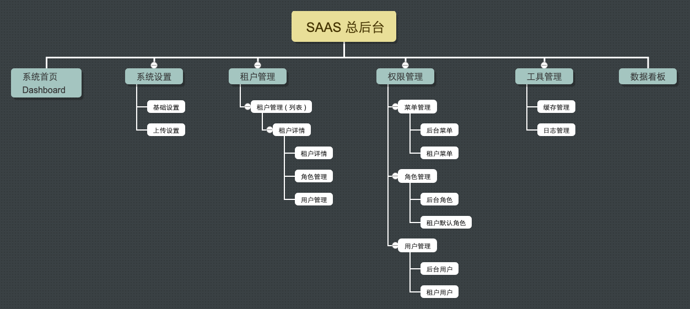

# 总后台

也叫做【平台管理】后台

# 菜单列表

# 功能说明 ( 仅为设想 )

## 套餐管理

说明：可以理解为商品

1. 名称：月套餐
2. 说明：
3. 服务周期：30 天
4. 原价：88 元
5. 现价：66 元
6. 库存：0 ( 0 表示无限制 )
7. 套餐功能配置：
    - 使用范围：不限制、仅官方、仅代理
    - 子账号数限制：0 ( 0 表示无限制 )

## 代理管理

### 1. 代理级别

说明：不同代理级别享受不同的折扣

例如：
1. 铜牌代理：9 折
2. 银牌代理：8 折
3. 金牌代理：7 折
4. 钻石代理：6 折

进阶：或是按照套餐享受折扣 ( 以后再考虑实现 )

### 2. 代理列表

## 财务管理

### 1. 订单管理

说明：租户购买应用的订单管理
